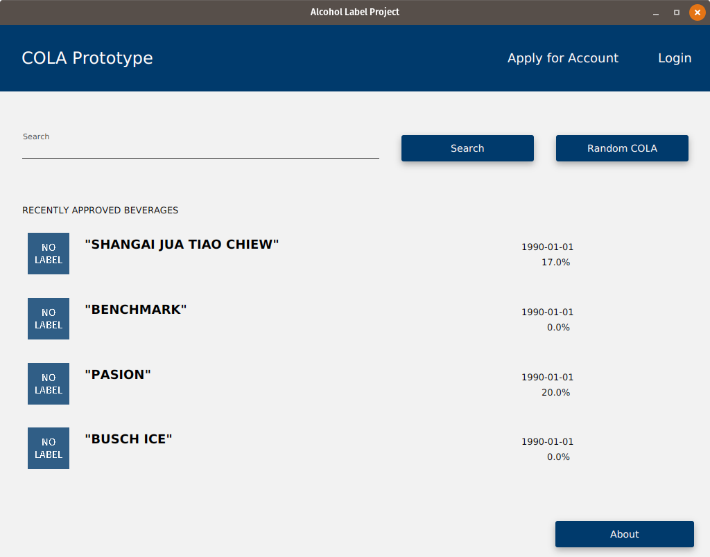
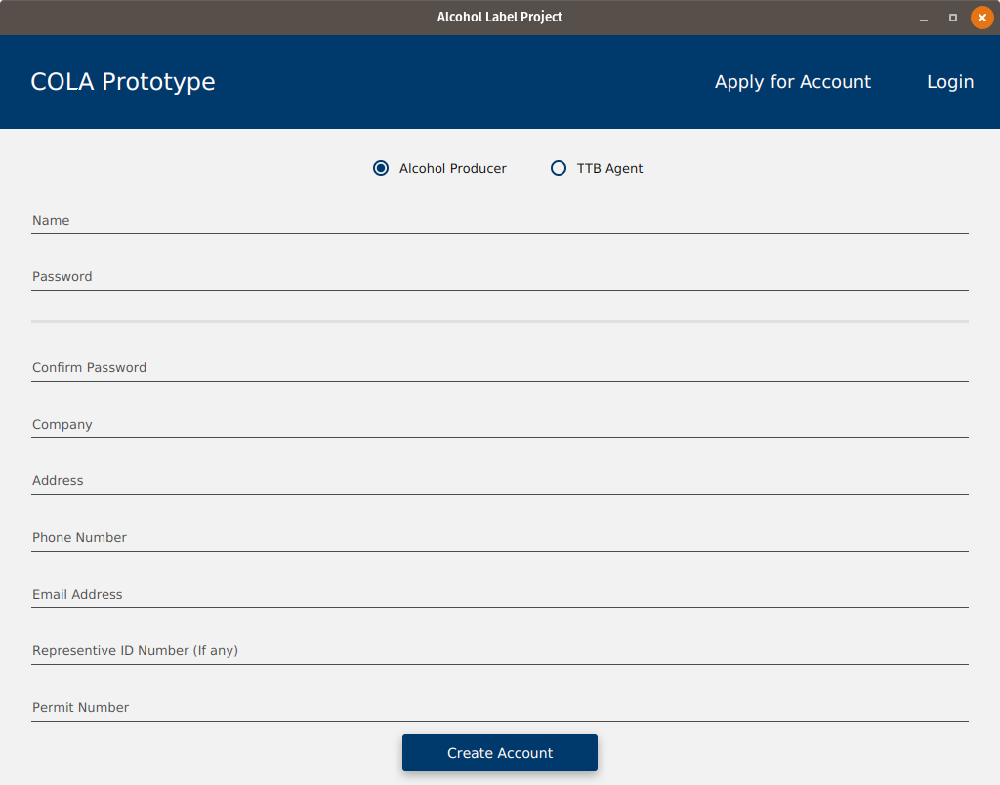

# TTB COLAs Prototype

In WPI's CS 3733 course, we had to create a prototype application for the US Treasury's Alcohol and Tobacco Tax and Trade Bureau. The application simulated a company's submission of alcoholic beverage labels for certification and the agency's processing of those submissions. The application also provided the capability to perform simple and complex searches on alcoholic beverage label data.

This application is the realization of the prototype, extended beyond what was completed in class (redesigned almost from the ground up) to create my vision of what the project could have been like if we had more time to work on it.

## Usage
To use this project, download the sources and execute the gradle application run task. The command is `./gradlew run` on Linux and Mac, and `gradlew.bat run` on Windows.

Once the application has started, you will need to create an account, so do that by clicking the create account button and fill out the information. Then login as the admin, with the username and password both set to admin. This will allow you to approve your user accounts. 

After the accounts are approved, you will be able to submit alcohol labels from the alcohol producer account, and will need to approve them from the TTB agent account. Once approved, they will appear in searches. 

To populate the database with existing applications from the COLAs platform, you will need to run the main method of the `PopulateDatabase` class. 

## Contributing
This repo is not open to contributing, you may fork it and make it your own, but I will not be accepting PRs. 

## Credits
I am responsible for the redesign of this application, and most of the code is now written by me. 

This is part of a class project, which had a team of 11 people. I was the lead software engineer of that team and you can find the contributors on the upstream project's repo. 

WPI and the TTB are also responsible for most of the requirements of this project, and also for the resources provided to build it. 

See the about page in the application for more details.

## License
Since this is a class project, there is no license file. With that being said, you are not allowed to use this code for commercial or promotional purposes, unless you are the TTB or WPI as these were the organizations we worked with in the development of the application. We were allowed to post it publicly on GitHub to help build our public portfolio.